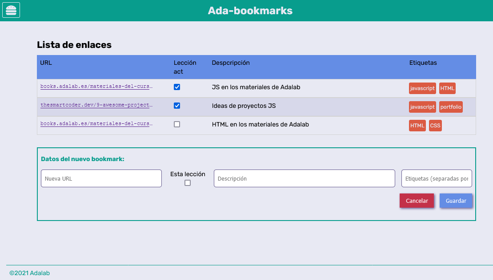
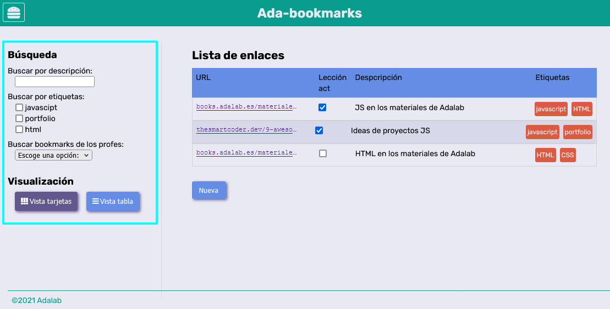
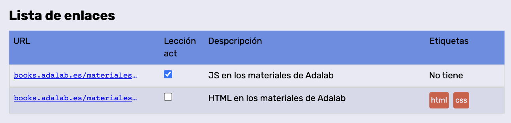

# DÍA 1

### 1. Crear un proyecto nuevo

Empezaremos lógicamente por crear un proyecto nuevo, para lo cual:

1. Cread un repositorio en GitHub llamado `promo-X-module-3-pair-Y-sprint-1-hangman-game`.
   - Cambiad la `X` por tu promo y la `Y` por tu número de pareja.
   - Cread el repo en **la organización de Adalab**.
   - Clónadlo en vuestros equipos.
2. Cread un nuevo proyecto de React dentro del repo clonado.
   - Si queréis podéis hacerlo con `create-react-app` o con un `react-starter-kit`.
3. Arráncadlo y poneos a programar.

### 2. Muestra el formulario de nuevo bookmarks

La usuaria puede añadir nuevos enlaces pulsando sobre el botón "Nueva" que mostrará un formulario para rellenar los datos del nuevo enlace a guardar. Prueba a mostrar el formulario asociado al botón de nuevo bookmark.

> **Pista**: Busca la sección que contiene este formualrio y utiliza la propiedad classList.remove("hidden");



### 3. Muestra el desplegable del menú hamburguesa

La aplicación tiene un menú hamburguesa (en la parte superior derecha) que al pulsar sobre él se muestran las opciones de filtrado y de visualización del listado. Prueba a mostrar este menú.

> **Pista**: Busca la sección que contiene este menú y utiliza la propiedad classList.remove("collapsed");
> P
> 

### 4. Agregar los enlaces dinámicamente

Ahora vamos a dar nuestros primeros pasos para que nuestra página sea dinámica, vamos a añadir la información estática de los enlaces que está en html desde Javascript. Para ello podemos seguir los siguientes pasos:

1.  Buscad el elemento utilizando el `document.queryselector(".js-datails")`. Recuerda primero añadir esta clase de js a la sección de listas.
2.  Copiad cada `li` dentro de una variable.
3.  Añadir esa variable utilizando propiedad `innerHTML` para agregar los enlaces.

# DÍA 2

## Ejercicio 1

Vamos a usar variables que luego interpolaremos en el string con el HTML de cada bookmark.
Os proponemos usar 6 variables por cada enlace:

1. Una variable para la URL (dirección del enlace).
1. Una variable para la descripción
1. Una variable para indicar si es del módulo actual o no.
1. Otras dos variables que indiquen las etiquetas de ese enlace.
1. Una última variable con el HTML del enlace en la que interpolaremos las anteriores.

Por ejemplo:

```js
const bmk_1_url =
  "https://books.adalab.es/materiales-del-curso-n/-MdR6Gp68BX20m1pi0z2/modulo-2-programando-la-web/javascript/2_1_intro_a_la_programacion";
const bmk_1_desc = "JS en los materiales de Adalab";
const bmk_1_seen = "checked";
const bmk_1_tags_1 = "javascript";
const bmk_1_tags_2 = "html";
```

> **Nota** : Usamos \_ en los nombres de las variables, pero por una razón académica.
> En JS se suele usar la notación [camelCase](https://es.wikipedia.org/wiki/Camel_case) para los nombres de variable.

## Ejercicio 2: Bonus

¿Serías capaz de buscar métodos de String para pasar a minúsculas el nombre de las etiquetas?

## Ejercicio 3: Bonus

¿Serías capaz de quitar el 'https://' del principio de la dirección en el contenido del enlace usando otro método de String? (en el href no se lo quites)

---

P.D.- Comenta el código de ayer en el que se mostraban el menú y el formulario.

# DÍA 3

# DÍA 4

## Ejercicio 1

Prueba a mostrar a cambiar la vista del panel de los enlaces en diferentes formatos: lista o tabla. La sección con la clase `data` añadimos las clases `tableview` para que la vista de los enlaces sea en tabla y `listview` para que se muestre en una lista, en dependencia del cual queremos activar. Para ello podemos ver cambiar la clase en el html ver si funciona correctamente:

```html
<section class="data tableview"></section>
```

> **Pista**: Utiliza condicionales y el `classList.contains`

## Ejercicio 2.

Vamos a comenzar a implementar el filtro de búsqueda por descripción. Para ello puedes:

1. Mostrar el menú hamburguesa y dejarlo siempre visible.
2. Seleccionamos el `input` con el `document.querySelector`

```js
const input_search_desc = document.querySelector(".js_in_search_desc");
```

3. Simulamos que escribe la usuaria en el `input` de búsqueda.

```js
input_search_desc.value = "materiales";
```

4. Recoger el valor del `input` en una variable.

```js
const descrSearchText = input_search_desc.value;
```

5. Utilizar un condicional con la función `includes` antes de añadir cada enlace para solo mostrar aquellos enlaces que contengan la palabra introducida por la usuaria:

```js
if( bmk_2_desc.includes(descrSearchText) ) {
    ....
```

## Ejercicio 3. BONUS

Vamos a validar la columna de las categorías de los enlaces: Si el enlace no tiene categoría mostraremos el mensaje **No tiene categorías**.



Para ello podemos verificar si las categorías tienen algún valor, y en dependencia del resultado del condicional mostrar un resultado u utro.

```js
if ((bmk_1_tags_1 === "") & (bmk_1_tags_2 === "")) {
  html += `<p class='item__tags'>No tiene</p>`;
} else {
  ...
}
```

## Ejercicio 4. BONUS

Cambia el valor de la variable `bmk_1_seen` a `true` o `false`. En dependencia de este valor muestra seleccionado o no el `input` de tipo `checkbox`.

## Bookmark: Funciones

Antes de hacer los ejercicios, coloca tus variables al principio del fichero `js`. Después, pondremos las funciones y en último lugar el código a ejecutar cuando se cargue la página.

## Ejercicio 1

Haz dos funciones (llamemoslas `displayTableView()` y `displayCardListView()`) para cambiar la visualización de los bookmark a tabla o a tarjetas. Estas funciones no reciben parámetros ni devuelven valor alguno.

Puedes usar las nuevas funciones dentro de los if del ejercicio de ayer... o no, puedes usarlas también desde la consola para probarlas.

## Ejercicio 2

Has dos funciones (se pueden llamar `showDropdownMenu()` y `hideDropdownMenu()`) para mostrar u ocultar el menú de visualización. ¿Necesitan recibir parámetros? ¿Devolverán algún valor?

Puedes probar estas funciones llamándolas desde la consola de las DevTools.

## Ejercicio 3

Haz una función llamada `showAddFrom()` que al ejecutarla nos muestre en la página el formulario para crear un nuevo bookmark.

## Ejercicio 4

Haz una función que se llame `renderBookmarkTags()` que reciba dos palabras (`strings`) como parámetros y nos devuelva como valor de retorno código HTML en un string. Este código tiene que ser:

- Si recibe dos palabras, devolverá el HTML que muestra la lista de etiquetas con una lista `ul`:

```html
<ul class="item__tags">
  <li class="item__tag">Etiqueta 1</li>
  <li class="item__tag">Etiqueta 2</li>
</ul>
```

- Si recibe una palabra en el primer parámetro pero el otro parámetro es un string vacío `''`, devolverá también HTML con una lista `<ul>` pero sólo con la palabra indicada por el primer parámetro.

```html
<ul class="item__tags">
  <li class="item__tag">Etiqueta</li>
</ul>
```

- Si recibe dos string vacíos como parámetros devolverá código HTML, pero esta vez será un párrafo diciéndo que no hay etiquetas:

```html
<p class="item__tags">No tiene</p>
```

Puedes probar esta función en la consola de las DevTools y ver qué HTML te devuelve en cada caso.

**BONUS:** Puedes "perfeccionar" la función para que tenga en cuenta si las etiquetas traen texto o un string vacío o undefined.

## Ejercicio 5

Haz una función que se llame `renderBookmark()` y que reciba como parámetros todos los datos que tenemos de un bookmark (URL, descripción, si es de la lección actual y etiquetas). Devolverá como valor de retorno un string con todo el HTML que representa al bookmark en la página.

La declaración de esta función podría ser así:

```js
function renderBookmark( url, desc, lesson, tags_1, tags_2 ) {
    ...
}
```

¿Necesitas llamar a la función del ejercicio 4 para hacer esta función?

¿Cómo podrías usar esta función para generar y poner en la página el HTML de cada bookmark que tenemos?
